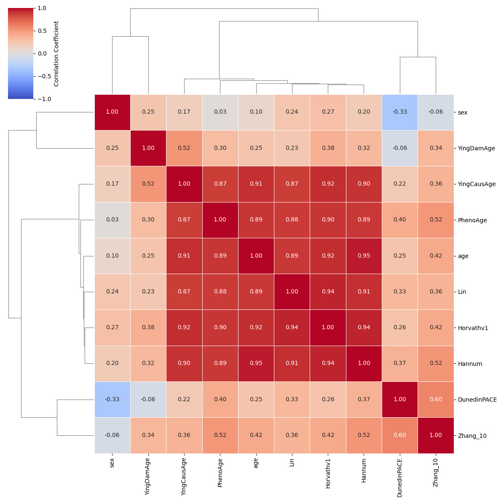
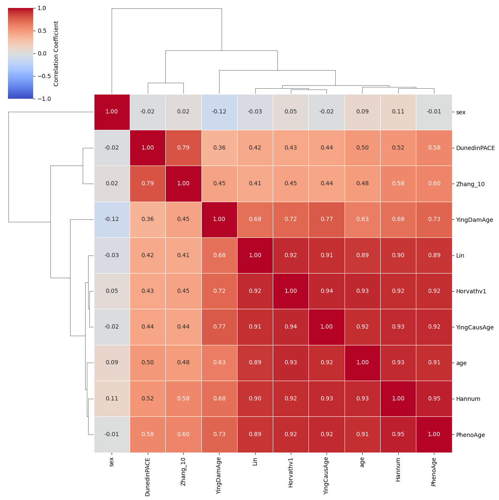
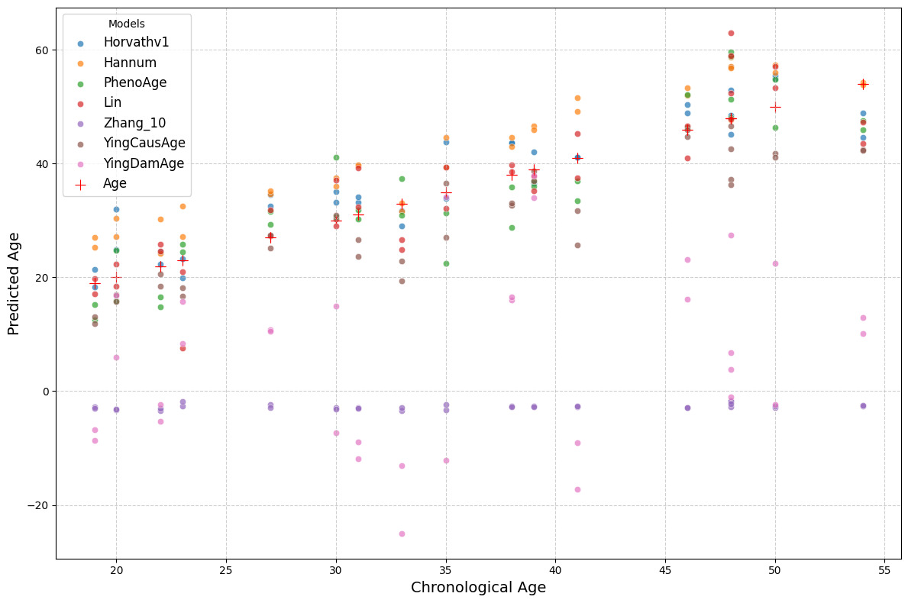
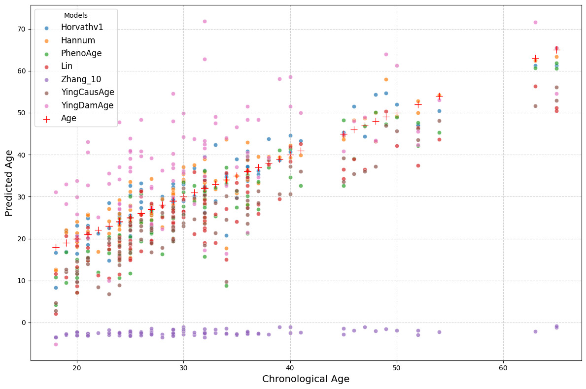
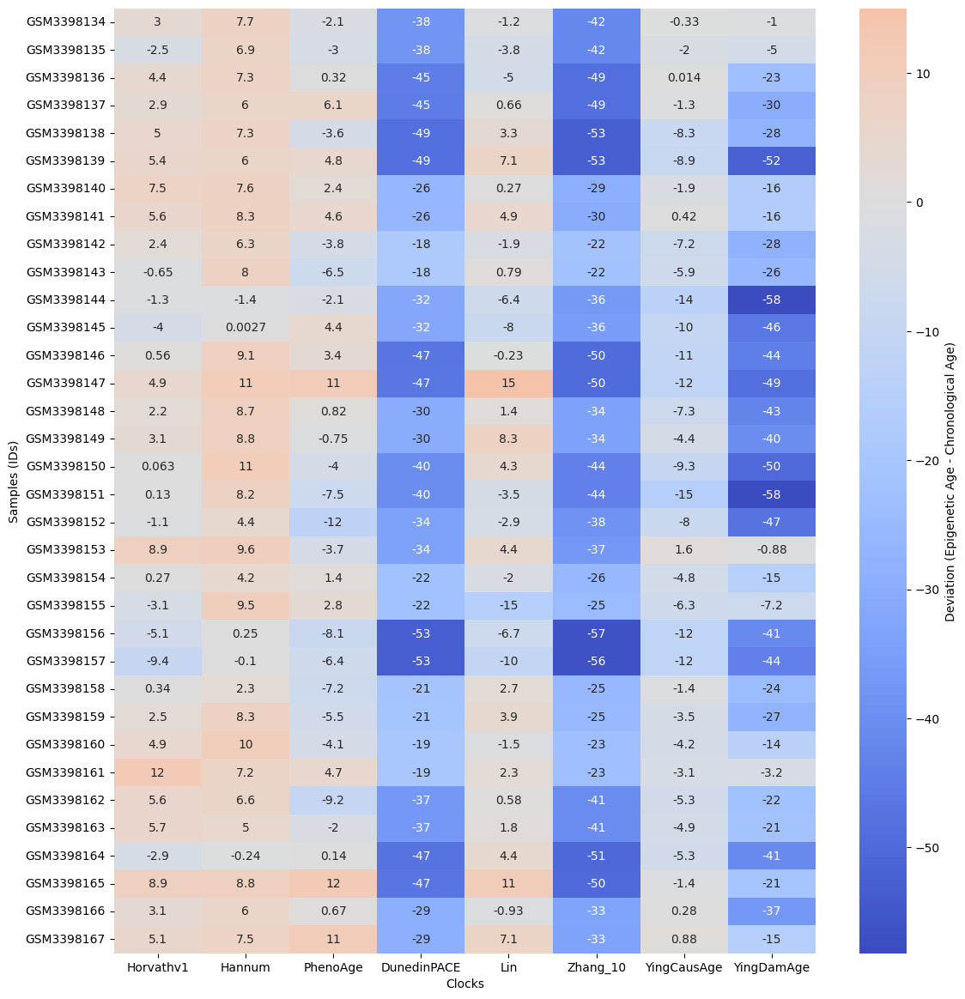
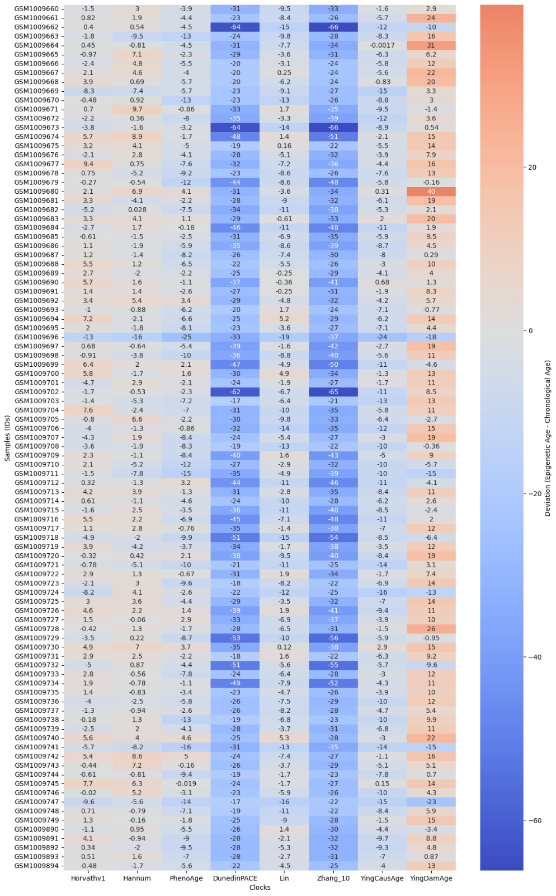
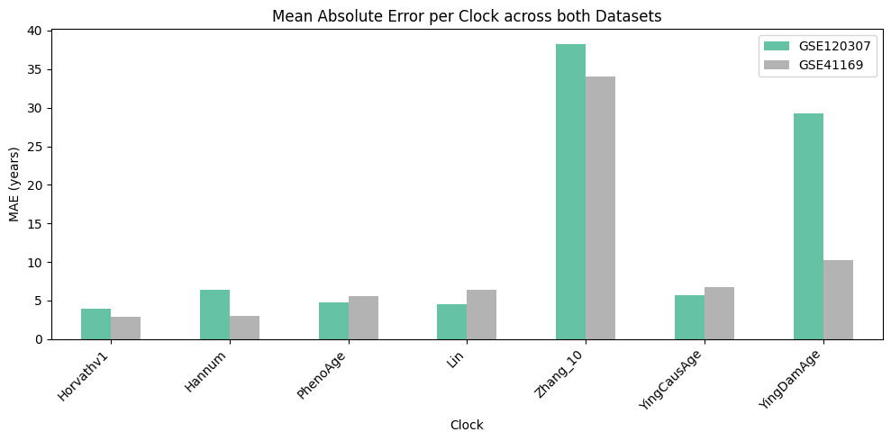
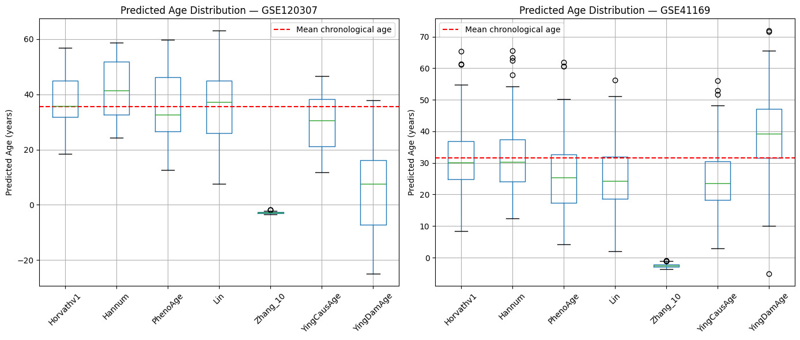

# EPIC Array: Epigenetic Aging Clock Benchmarking

This is the EPIC array part of the assignment. The analysis uses the Biolearn library to run 8 epigenetic aging clocks on two public blood DNA methylation datasets and compares their performance through correlation matrices, age deviation heatmaps, age prediction scatter plots, mean absolute error benchmarking, and predicted age distribution box plots.

The Biolearn library handles all dataset loading from GEO and clock computation internally, which made the analysis straightforward to set up. The most interesting result is how dramatically Zhang_10 underperforms on the smaller dataset despite being a published mortality predictor, and how DunedinPACE separates completely from all the other clocks in the correlation matrices because it is measuring something fundamentally different.

---

## Dataset

**Dataset 1: GSE120307**
Blood DNA methylation dataset with 34 samples profiled on the Illumina 450k array. Age range 19 to 54 years. This is the dataset used in the official Biolearn documentation examples. Loaded via `DataLibrary().get("GSE120307").load()`.

**Dataset 2: GSE41169**
Blood DNA methylation dataset with 95 samples from a Dutch population study, profiled on the Illumina 450k array. Age range 18 to 65 years. Loaded via `DataLibrary().get("GSE41169").load()`.

Both datasets are blood derived. This matters because most of the clocks selected were trained specifically on blood tissue. Using the same tissue type across both datasets keeps the cross-dataset comparison biologically meaningful rather than confounded by tissue effects.

---

## Platform

Google Colab (Python 3.10)

---

## Dependencies
```python
pip install biolearn
```

---

## Workflow

### 1. Installation and Imports

```python
!pip install biolearn -q

import matplotlib.pyplot as plt
import warnings
warnings.filterwarnings('ignore')

from biolearn.data_library import DataLibrary
from biolearn.model_gallery import ModelGallery
from biolearn.visualize import (
    plot_clock_correlation_matrix,
    plot_clock_deviation_heatmap,
    plot_age_prediction
)
```

Biolearn is installed via pip. The three core visualization functions used are `plot_clock_correlation_matrix`, `plot_clock_deviation_heatmap`, and `plot_age_prediction`. Additional MAE and distribution plots are generated using pandas and matplotlib directly.

### 2. Dataset Loading

```python
data1 = DataLibrary().get("GSE120307").load()
data2 = DataLibrary().get("GSE41169").load()
```

`DataLibrary().get()` fetches the dataset from GEO and returns a standardized object containing a methylation matrix (`dnam`) and sample metadata including chronological age. All downloading, parsing, and normalization is handled internally by Biolearn. GSE40279 (656 samples) was initially attempted as Dataset 2 but caused a RAM crash on the free Colab tier, so GSE41169 (95 samples) was used instead.

### 3. Clock Loading

```python
clock_names = [
    "Horvathv1", "Hannum", "PhenoAge", "DunedinPACE",
    "Lin", "Zhang_10", "YingCausAge", "YingDamAge",
]
gallery = ModelGallery()
models = [gallery.get(name) for name in clock_names]
```

Each clock is loaded from `ModelGallery()` using its standardized name. The 8 clocks span three generations of clock development: first generation chronological clocks (Horvathv1, Hannum, Lin), second generation biological age clocks (PhenoAge), pace of aging models (DunedinPACE), minimal marker clocks (Zhang_10), and causality-enriched clocks (YingCausAge, YingDamAge).

### 4. Correlation Matrix

```python
plot_clock_correlation_matrix(models=models, data=data1)
plot_clock_correlation_matrix(models=models, data=data2)
```

Computes Pearson correlations between every pair of clock predictions across all samples and displays the result as a hierarchically clustered heatmap. This reveals which clocks capture similar biological signals and which are measuring something distinct. Run separately for both datasets.

### 5. Age Deviation Heatmap

```python
plot_clock_deviation_heatmap(models=models, data=data1)
plot_clock_deviation_heatmap(models=models, data=data2)
```

Computes predicted age minus chronological age for each sample and each clock and displays the result as a heatmap. Warm colors mean the clock predicts the sample as biologically older than their real age. Cool colors mean younger. This reveals both systematic clock biases and individual samples with consistent multi-clock age acceleration.

### 6. Age Prediction vs Chronological Age

```python
age_clock_names = ["Horvathv1", "Hannum", "PhenoAge", "Lin", "Zhang_10", "YingCausAge", "YingDamAge"]
age_models = [gallery.get(name) for name in age_clock_names]

plot_age_prediction(models=age_models, data=data1)
plot_age_prediction(models=age_models, data=data2)
```

Scatter plots of predicted age against chronological age for each clock. DunedinPACE is excluded because it outputs a dimensionless pace-of-aging rate rather than years, making direct comparison with chronological age on the same axis meaningless.

### 7. MAE Benchmarking

```python
import pandas as pd
import numpy as np

mae_results = {}
for name, model in zip(age_clock_names, age_models):
    try:
        result1 = model.predict(data1)
        result2 = model.predict(data2)
        pred1 = result1.iloc[:, 0]
        pred2 = result2.iloc[:, 0]
        actual1 = data1.metadata['age']
        actual2 = data2.metadata['age']
        common1 = pred1.index.intersection(actual1.index)
        common2 = pred2.index.intersection(actual2.index)
        mae1 = np.mean(np.abs(pred1[common1] - actual1[common1]))
        mae2 = np.mean(np.abs(pred2[common2] - actual2[common2]))
        mae_results[name] = {'GSE120307': round(mae1, 2), 'GSE41169': round(mae2, 2)}
    except Exception as e:
        print(f"Skipping {name}: {e}")

mae_df = pd.DataFrame(mae_results).T
mae_df.plot(kind='bar', figsize=(10, 5), colormap='Set2')
plt.tight_layout()
plt.show()
```

Mean Absolute Error is computed for each clock on both datasets by calling `model.predict(data)`, extracting the prediction column, aligning indices with the metadata age column, and computing the mean absolute difference. Results are shown as a grouped bar chart for direct comparison.

### 8. Predicted Age Distribution

```python
fig, axes = plt.subplots(1, 2, figsize=(14, 6))
for ax, data, title in zip(axes, [data1, data2], ["GSE120307", "GSE41169"]):
    preds = {}
    for name, model in zip(age_clock_names, age_models):
        try:
            result = model.predict(data)
            preds[name] = result.iloc[:, 0].values
        except:
            pass
    pred_df = pd.DataFrame(preds)
    pred_df.boxplot(ax=ax, rot=45)
    ax.axhline(y=data.metadata['age'].mean(), color='red', linestyle='--', label='Mean chronological age')
    ax.set_title(f"Predicted Age Distribution — {title}")
    ax.set_ylabel("Predicted Age (years)")
    ax.legend()
plt.tight_layout()
plt.show()
```

Box plots of the full predicted age distribution per clock for both datasets, with the mean chronological age marked as a red dashed line. A well-calibrated clock should have its median roughly aligned with the mean chronological age of the dataset.

---

## Results

### Correlation Matrices


GSE120307 (34 samples): Horvathv1, Hannum, Lin, YingCausAge, and PhenoAge form a tightly correlated cluster with values above 0.87. DunedinPACE shows negative or near-zero correlations with all other clocks, which is expected because it measures pace of aging rather than absolute age in years. Zhang_10 clusters separately with moderate correlations reflecting its distinct 10-CpG basis.


GSE41169 (95 samples): The same broad clustering holds but correlations among the main age-predicting clocks are somewhat lower, consistent with greater biological diversity in the larger cohort. YingDamAge shows notably lower correlations compared to the GSE120307 result, suggesting its signal is more sensitive to cohort composition.

### Age Deviation Heatmaps


GSE120307: DunedinPACE produces the most extreme negative deviations (up to minus 58 years) because it outputs a rate near 1.0 rather than years, producing very large negative values when chronological age is subtracted. Among the proper age-predicting clocks, Horvathv1 and Hannum stay mostly within ±10 years.


GSE41169: With 95 samples, consistent multi-clock age acceleration patterns are visible across individual samples, suggesting genuine biological age differences rather than random clock noise.

### Age Prediction Plots


GSE120307: The compressed age range (19 to 54 years) limits evaluation at the extremes. Horvathv1 and Lin show the closest tracking to the diagonal. Zhang_10 shows severe underprediction with many samples near zero or negative predicted age.


GSE41169: With a wider age range (18 to 65 years) and more samples, the age-correlated trend is clearly visible in all clocks. Regression to the mean is visible in several clocks, with predictions compressed toward the dataset mean at both extremes.

### MAE Comparison


Horvathv1 achieves the lowest MAE on both datasets (~4 years on GSE120307, ~3 years on GSE41169). Zhang_10 has the highest MAE by a wide margin (~38 years on GSE120307), confirming that its 10-CpG design comes at a significant accuracy cost. YingDamAge shows substantially higher MAE on the smaller dataset, suggesting its signal requires a larger cohort to stabilize.

### Predicted Age Distributions


Most clocks are centered near the mean chronological age of each dataset (red dashed line). Zhang_10 is a clear outlier with median predictions near zero on GSE120307. The wider interquartile range of YingDamAge on GSE120307 compared to GSE41169 is consistent with its higher MAE on the smaller dataset.

---

## Notebook

The notebook `biolearn_aging_clocks.ipynb` is fully documented with detailed markdown explanations before every code block, covering the biological rationale behind each step, what each function does to the data, and how to interpret each output.

---

## References

[Biolearn documentation](https://bio-learn.github.io/)

[Biolearn clock gallery](https://bio-learn.github.io/clocks.html)

## Citations

Ying, K., Paulson, S., Perez-Guevara, M., Emamifar, M., Martinez, M.C., Kwon, D., Poganik, J.R., Moqri, M., and Gladyshev, V.N. (2023). Biolearn, an open-source library for biomarkers of aging. *bioRxiv*. https://doi.org/10.1101/2023.12.02.569722

Horvath, S. (2013). DNA methylation age of human tissues and cell types. *Genome Biology* 14: R115. https://doi.org/10.1186/gb-2013-14-10-r115

Hannum, G., et al. (2013). Genome-wide Methylation Profiles Reveal Quantitative Views of Human Aging Rates. *Molecular Cell* 49(2): 359-367. https://doi.org/10.1016/j.molcel.2012.10.016

Levine, M.E., et al. (2018). An epigenetic biomarker of aging for lifespan and healthspan. *Aging* 10(4): 573-591. https://doi.org/10.18632/aging.101414

Belsky, D.W., et al. (2022). DunedinPACE, a DNA methylation biomarker of the pace of aging. *eLife* 11: e73420. https://doi.org/10.7554/eLife.73420

Ying, K., et al. (2022). Causally enriched epigenetic clocks. *bioRxiv*. https://doi.org/10.1101/2022.10.07.511382
