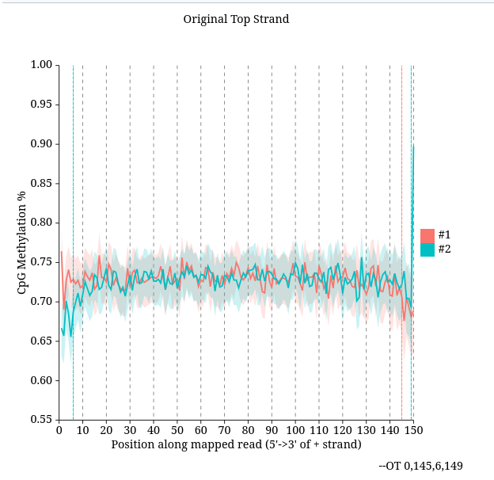
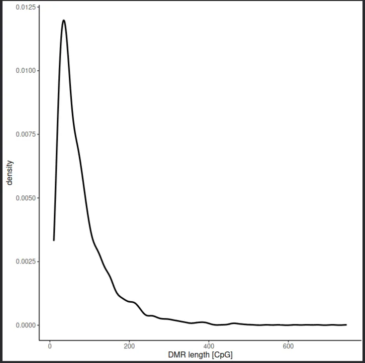
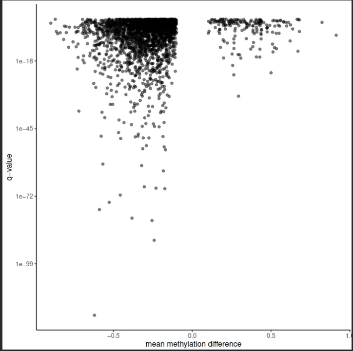

# WGBS: Bisulfite Sequencing Pipeline

This is the WGBS part of the assignment. The pipeline follows the Galaxy Training Network methylation-seq tutorial based on Lin et al. (2015), which sequenced the DNA methylomes of normal breast tissue, fibroadenoma, and invasive ductal carcinoma samples using whole genome bisulfite sequencing. The tutorial walks through quality control, bisulfite-aware alignment, methylation extraction, visualization around CpG islands, and differentially methylated region detection between normal and cancer tissue.

Everything here was done in Galaxy. I found the tool setup mostly straightforward once I understood why bisulfite data looks the way it does in QC and why you cannot use a regular aligner. The Metilene step at the end is where the actual biology comes through and the DMR plots are the most interesting outputs of the whole pipeline.

---

## Dataset

A small subset of the original Lin et al. (2015) WGBS data is used for the QC, alignment, and methylation extraction steps. For the visualization and DMR detection steps, precomputed bedGraph files from all six samples in the paper are used directly.

The six samples are: NB1 and NB2 (normal breast tissue), BT089 (fibroadenoma), BT126 and BT198 (invasive ductal carcinoma), and MCF7 (breast adenocarcinoma cell line). All raw and precomputed files are loaded directly from Zenodo (https://zenodo.org/record/557099) into Galaxy using Paste/Fetch Data.

---

## Platform

All steps were run on Galaxy Europe (usegalaxy.eu).

---

## Dependencies
```
Falco 1.2.4
bwameth 0.2.7
MethylDackel 0.5.2
Wig/BedGraph-to-bigWig 1.9.1
computeMatrix 3.5.4
plotProfile 3.5.4
Metilene 0.2.6.1
```

---

## Workflow

### 1. Data Upload
https://zenodo.org/record/557099/files/subset_1.fastq

https://zenodo.org/record/557099/files/subset_2.fastq

Both files were uploaded via Upload > Paste/Fetch Data. Galaxy auto-detected the format as fastq, which is correct. These are paired-end Illumina reads from bisulfite-treated breast tissue DNA, representing a small subset of the original paper's data chosen to keep computation time feasible.

### 2. Quality Control with Falco
```
Tool: Falco 1.2.4
Input: subset_1.fastq, subset_2.fastq (both selected simultaneously)
All other settings: default
```

Falco is an optimized reimplementation of FastQC. The per base sequence content plot shows T elevated to approximately 50% and C nearly absent across all positions. Falco flags this as fail by its standard thresholds, but this is the expected bisulfite conversion signature. Every unmethylated cytosine is chemically converted to uracil during bisulfite treatment and read as T during sequencing, so C content drops dramatically. The fact that this flag appears confirms the bisulfite conversion worked correctly, not that there is a problem with the data.

### 3. Alignment with bwameth

```
Tool: bwameth 0.2.7
Reference genome: Human hg38full (built-in index)
Library type: Paired-end
Read 1: subset_1.fastq
Read 2: subset_2.fastq
```

A standard aligner like BWA or HISAT2 cannot be used on bisulfite data because it has no way to distinguish a T in the read that was originally a T in the genome from a T that was originally an unmethylated C that got converted. bwameth handles this using a three-letter alignment strategy where both the reads and the reference are virtually converted and aligned in a way that preserves methylation information. The output is a sorted BAM file.

### 4. Methylation Bias Check with MethylDackel

```
Tool: MethylDackel 0.5.2
Reference genome: Human hg38 (local cache)
Sorted BAM: bwameth output
Mode: Determine methylation bias (mbias)
Keep singletons: Yes
Keep discordant alignments: Yes
```

This step checks whether CpG methylation levels are consistent across all positions along the read or whether there is a drop or spike at the 5' or 3' ends. A positional bias can arise from incomplete bisulfite conversion at read ends or end repair artifacts during library preparation, and would require trimming the affected positions before extraction. The original top strand output showed methylation consistently at 70 to 75% across all positions with only minor variation at the very ends, well within the acceptable threshold. No trimming was applied.

### 5. Methylation Extraction with MethylDackel

```
Tool: MethylDackel 0.5.2
Reference genome: Human hg38 (local cache)
Sorted BAM: bwameth output
Mode: Extract methylation metrics
Merge per-Cytosine metrics: Yes
Output: CpG methylation fractions
```

This produces a bedGraph file where each row is a CpG site with its genomic coordinates and a methylation fraction between 0 and 1. This is the direct output of the bisulfite sequencing experiment: for every CpG in the genome covered by enough reads, we now know what fraction of DNA molecules had that cytosine methylated.

### 6. Conversion to bigWig and CpG Island Import

```
Tool: Wig/BedGraph-to-bigWig 1.9.1
Input: MethylDackel fraction CpG output
Database/Build: Human Dec. 2013 (GRCh38/hg38)
```

The MethylDackel bedGraph output must be converted to bigWig before DeepTools can use it. Before running the conversion, the Database/Build attribute on the bedGraph dataset must be set to hg38 via the pencil icon, otherwise Galaxy cannot locate the chromosome size file and the conversion fails.

The CpG islands BED file was also imported at this stage from `https://zenodo.org/records/557099/files/CpGIslands.bed`.

### 7. Methylation Profile Around CpG Islands (Subset)

```
Tool: computeMatrix 3.5.4
Regions to plot: CpGIslands.bed
Score file: bigWig output
Mode: reference-point
Tool: plotProfile 3.5.4
Matrix: computeMatrix output
```

computeMatrix computes the methylation score from the bigWig file in a window around each CpG island center, producing a matrix. plotProfile then averages across all CpG islands to produce a single profile line showing how methylation changes as you move from upstream of CpG islands through their centers and downstream. The dip at the TSS in the output is the expected promoter hypomethylation signature of actively transcribed genes.

### 8. Methylation Profile Across All Six Samples


```
Tool: Wig/BedGraph-to-bigWig 1.9.1
Input: dataset collection of 6 bedGraph files (all_coverage_files)
Tool: computeMatrix 3.5.4
Regions: CpGIslands.bed, Mode: reference-point
Tool: plotProfile 3.5.4
Make one plot per group of regions: Yes
```

The six precomputed UCSC-format bedGraph files were imported from Zenodo, assembled into a Galaxy dataset collection named `all_coverage_files`, and the datatype and Database/Build were set to bedgraph and hg38 on the collection before conversion. plotProfile with one plot per group produces a panel showing all six samples simultaneously, making the cancer vs normal methylation differences directly visible.

### 9. DMR Detection with Metilene

```
Tool: Metilene 0.2.6.1
Input group 1: NB1_CpG.meth.bedGraph, NB2_CpG.meth.bedGraph
Input group 2: BT198_CpG.meth.bedGraph
BED file: CpGIslands.bed
```

Note: The Ensembl-format bedGraph files (without the ucsc suffix) are used here, not the UCSC-converted ones from the visualization step. Metilene uses Ensembl chromosome naming and the UCSC files would cause chromosome name mismatches.

Metilene identifies genomic regions where methylation differs significantly between the two groups using a statistical test based on mean methylation differences and permutation-derived q-values. The output PDF contains five diagnostic plots characterizing the detected DMRs.

---

## Results

### Falco QC


Per base sequence content for subset_1.fastq. T is dominant (~50%) and C is nearly absent. This is the correct bisulfite sequencing signature, not a quality failure.


Per base sequence content for subset_2.fastq. The same bisulfite pattern as subset_1, confirming consistent conversion across both paired reads.

### Methylation Bias


Original top strand methylation bias from MethylDackel. Methylation is stable at 70 to 75% across all 150 read positions. No positional bias requiring trimming was detected.

### Methylation Profiles


plotProfile output for the subset sample centered on CpG islands. The dip at the TSS reflects hypomethylation of active gene promoters.


plotProfile for all 6 samples. Normal breast samples (NB1, NB2) have the lowest TSS methylation. Cancer samples (MCF7, BT198) have consistently higher methylation at the TSS, reflecting the aberrant promoter hypermethylation and gene silencing documented in Lin et al. (2015).

### Metilene DMR Results


Distribution of mean methylation differences between normal and cancer. The left-skewed distribution reflects global hypomethylation in cancer, with a smaller right peak of hypermethylated DMRs representing promoter-specific gains in methylation.


DMR length distribution in nucleotides. Most DMRs are below 2000 nt. A long tail extends to over 30,000 nt representing large blocks of coordinated differential methylation.



DMR length in CpG count. The peak around 25 to 50 CpGs reflects the typical density of a CpG island. A small number of DMRs extend to over 600 CpGs.



Mean methylation difference vs q-value. DMRs with differences around -0.5 reach q-values below 1e-100, representing CpG islands almost completely unmethylated in cancer but methylated in normal tissue.


Mean methylation in normal breast (x-axis) vs BT198 cancer (y-axis). Points above the diagonal are hypermethylated in cancer. The dense cluster near (0, 0.25 to 0.4) represents regions nearly unmethylated in normal tissue that gain methylation specifically in cancer, the classic promoter hypermethylation pattern of breast cancer.


DMR length in nucleotides vs CpG count. The linear relationship confirms consistent CpG density across DMRs. Outliers above the trend line are CpG-dense island regions.

---

## References

[Galaxy Training Network: DNA Methylation data analysis](https://training.galaxyproject.org/training-material/topics/epigenetics/tutorials/methylation-seq/tutorial.html)

Lin, I.-H., Chen, D.-T., Chang, Y.-F., Lee, Y.-L., Su, C.-H., et al. (2015). Hierarchical Clustering of Breast Cancer Methylomes Revealed Differentially Methylated and Expressed Breast Cancer Genes. *PLOS ONE* 10(2): e0118453. https://doi.org/10.1371/journal.pone.0118453


